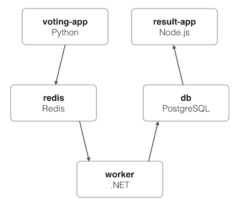
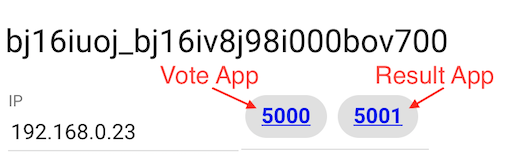

# Exercise 1 - Write and Deploy a Compose file

> **Time**: Approximately 10 minutes
>
> **Difficulty**: Easy

During this exercise we will build a Docker Compose file that is ready to deploy as a Docker Application.

## Docker Compose Background

Docker Compose is a tool designed to make it easy to define and share multi-container applications. While you can do everything in Docker Compose with Docker CLI commands, defining it in a YAML file makes it easy to share. Plus, the application stack is able to be version controlled.

For this exercise, we will start with an existing compose file. But, it has missing pieces in it, which we will fill in to learn about the various components of a compose file. We will then build on this file for the next exercises.

Many development teams have a `docker-compose.yml` file that is intended for development (mounts in source code, uses a dev-enabled container) and a `docker-stack.yml` file for production deploys (uses built images, no code mounting). Since Docker App requires a production deploy, it'll typically reflect the setup used in a `docker-stack.yml` file. For simplicity in this exercise (since we are using Docker Compose), we are using a `docker-compose.yml`.


## The Application

For this workshop, we will use a modified version of the [Voting App](https://github.com/dockersamples/example-voting-app). This application contains the following services:

- A Python webapp that provides the ability to vote between two options
- A Redis cache to store new votes
- A .NET Core worker to consume votes and store them in…
- A Postgres DB backed by a Docker volume for storing results
- A Node.js webapp to show the results of the voting in real time




## Finishing the Compose File

The compose file found in the `exercise_1` directory has all of the services needed for the application, but has a few missing pieces to help us learn a little bit more about Docker Compose. We will fill in a few pieces now, but will continue to evolve our compose file as we advance through the workshop.


### Helpful Tips for Play-with-Docker

- Working within the terminal can be tricky, especially for folks not familiar for CLI-based text editors. To help, use the "Editor" feature in PWD.
- You can drag-and-drop files from your local machine on to the terminal to easily upload them.


### Exposing the Vote and Result Apps

Both the `vote` and `results` services are webapps. However, there's currently no port mapping for the services. In order to access the apps, we need to expose the ports.

For the `vote` service, we'll use the "[short syntax](https://docs.docker.com/compose/compose-file/#short-syntax-1)" for port mappings. The syntax is `host-port:container-port`. As an example, `5000:80` will map port 5000 from the host to port 80 in the container.

```yml
services:
  vote:
    ports:
      - 5000:80
```

For the `results` service, let's use the "[long syntax](https://docs.docker.com/compose/compose-file/#long-syntax-1)" form. While longer, it's much easier to quickly see what's going on and helps those that can't remember the order of ports in the short syntax.

```yml
services:
  results:
    ports:
      - target: 80
        published: 5001
        protocol: tcp
        mode: host
```

This will expose our `results` service on port 5001.


### Persisting our Database's Data

Databases are pretty important and it's usually preferred to keep the data longer than a single container restart. As such, we need to store the data in a volume. 

In this case, we don't care _where_ the data is stored, as long as it's there every time we start the container. This is a good candidate for using a named volume. For this service, we will use a "[short syntax](https://docs.docker.com/compose/compose-file/#short-syntax-3)" definition.

```yaml
services:
  db:
    volumes:
      - db-data:/var/lib/postgresql/data
```

In order for this to work, we also need to declare the volume in the `volumes` section. So, let's add that as well. This snippet will go at the bottom of the file.

```yaml
volumes:
  db-data:
```

This volume definition will create a volume using the default driver (which is `local`). Since we are using local, we do have a chance of data loss. If running this app in a clustered environment and a restart gets scheduled on another node, a new local volume will be created on the new node. Therefore, **we should use a network-enabled volume driver in a production environment**. For this workshop, we will just use the local driver.


## Starting the Application Stack

Now that we have our compose file setup and configured, let's start it up! Use the following command to start it up. Once you do so, you'll see it pull all of the images necessary to run the full stack.

```bash
$ docker-compose up -d
Creating network "front-tier" with the default driver
Creating network "back-tier" with the default driver
Creating volume "root_db-data" with default driver
Creating root_redis_1  ... done
Creating root_worker_1 ... done
Creating root_db_1     ... done
Creating root_result_1 ... done
Creating root_vote_1   ... done
```

You'll see all of the networks, volume, and services get created. After a moment, you should see badges appear for the exposed ports. Click on the badge for 5000 to visit the vote app and 5001 for the results app.



### Other Useful Commands

- `docker-compose logs -f` - view all of the logs for all services in the application stack.
- `docker-compose ps` - view all containers running in the application stack. Similar to `docker ps`, but just for the stack

```bash
$ docker-compose ps
    Name                   Command               State          Ports
-----------------------------------------------------------------------------
root_db_1       docker-entrypoint.sh postgres    Up      5432/tcp
root_redis_1    docker-entrypoint.sh redis ...   Up      6379/tcp
root_result_1   node server.js                   Up      0.0.0.0:5001->80/tcp
root_vote_1     gunicorn app:app -b 0.0.0. ...   Up      0.0.0.0:5000->80/tcp
root_worker_1   /bin/sh -c dotnet src/Work ...   Up
```

## Cleaning Up

Once you're done, go ahead and shut everything down.

```bash
$ docker-compose down
Stopping root_vote_1   ... done
Stopping root_result_1 ... done
Stopping root_redis_1  ... done
Stopping root_db_1     ... done
Stopping root_worker_1 ... done
Removing root_vote_1   ... done
Removing root_result_1 ... done
Removing root_redis_1  ... done
Removing root_db_1     ... done
Removing root_worker_1 ... done
Removing network front-tier
Removing network back-tier
```

You'll see that all of the containers and networks are removed. However, volumes are NOT removed by default. If you wish to remove the volume, add the `-v` flag.

```bash
$ docker-compose down -v
Removing volume root_db-data
```

And now we're ready for the next exercise!
