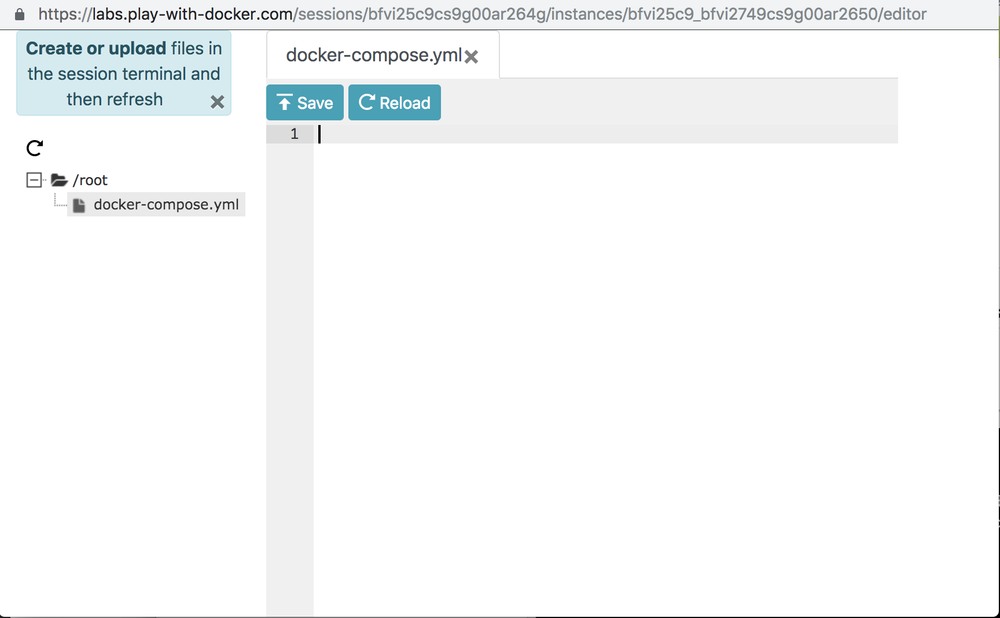
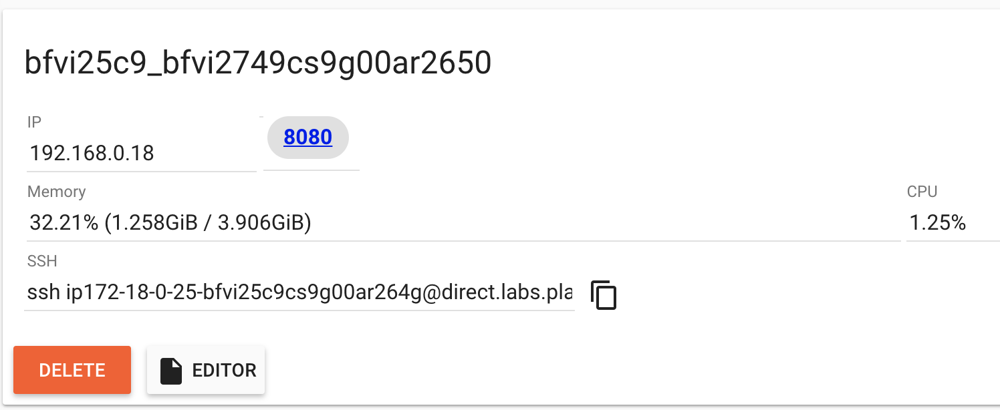

# Exercise 1 - Write and Deploy a Compose file

> **Time**: Approximately 20 minutes
> > **Difficulty**: Easy

During this exercise we will learn how to write a Compose file and deploy it on a Swarm cluster.

## Write a Compose file

* **Write a compose file** `docker-compose.yml` with the following elements:
- Compose version `3.7`
- One service `hello`
- Runs the `hashicorp/http-echo:latest` image
- Listen and expose port `8080`
- The service should print `Hello DockerCon`

**Help**: You can run this image `hashicorp/http-echo:latest` to get some help
```sh
$ docker run hashicorp/http-echo:latest --help
Usage of /http-echo:
  -listen string
        address and port to listen (default ":5678")
  -text string
        text to put on the webpage
  -version
        display version information
```
**NOTE:** You can edit a file after touching it, using the PWD online editor.


Touch your file before editing it, then click the refresh button:
```sh
$ touch docker-compose.yml
```


You should have a file like the following:
```yaml
version: '3.7'
services:
  hello:
    image: hashicorp/http-echo:latest
    command: ["-text", "Hello DockerCon", "-listen",":8080"]
    ports:
     - 8080:8080
```

## Deploy your Compose file

Now that we have a compose file, we need to deploy it. There are two ways to do this:
1. Using `docker-compose up`
1. Using `docker stack deploy`

### Deploy using docker-compose

`docker-compose up` will use the `docker-compose.yml` file in the current directory.

* **Try it now**:

```sh
/workshop $ docker-compose up
WARNING: The Docker Engine you're using is running in swarm mode.Compose does not use swarm mode to deploy services to multiple nodes in a swarm. All containers will be scheduled on the current node.
To deploy your application across the swarm, use `docker stack deploy`.
Creating network "workshop_default" with the default driver
Pulling hello (hashicorp/http-echo:latest)...
latest: Pulling from hashicorp/http-echo
86399148984b: Pull complete
Creating workshop_hello_1_b8ad94bc929a ... done
Attaching to workshop_hello_1_550ca1a27072
hello_1_550ca1a27072 | 2018/11/29 10:20:00 Server is listening on :8080
```

Once deployed, a new link appears with the exposed port `8080`:


* **Click on it**, it should open a new tab and display `Hello DockerCon`.
* **Hit `Ctrl+C`** to stop and nicely remove the service.
```sh
^C
Gracefully stopping... (press Ctrl+C again to force)
Stopping workshop_hello_1_550ca1a27072 ... done
```

**NOTE:** that the containers are prefixed with the `current directory` then `service` then `replicas index`. The application name is the current directory.

**NOTE:** Hit `Alt+Enter` to enter a *fullscreen* mode

### Deploy using `docker stack`

Another way to deploy your compose file is to use `docker stack deploy`. It introduces the concept of stack, which you can query directly from docker.
During this workshop we will focus on `swarm` orchestrator, but the same commands work the same way targeting `kubernetes` orchestrator.

The `docker stack` commands
```sh
$ docker stack --help

Usage:  docker stack [OPTIONS] COMMAND

Manage Docker stacks

Options:
      --orchestrator string   Orchestrator to use (swarm|kubernetes|all)

Commands:
  deploy      Deploy a new stack or update an existing stack
  ls          List stacks
  ps          List the tasks in the stack
  rm          Remove one or more stacks
  services    List the services in the stack

Run 'docker stack COMMAND --help' for more information on a command.
```

We will now use the following `docker-compose.yml` file, which describes a simple application with 3 services, a frontend, a backend and a database.
```yaml
version: "3.7"
services:
    web:
     image: dockerdemos/lab-web
     ports:
      - "33000:80"

    words:
     image: dockerdemos/lab-words
     deploy:
       replicas: 3
       endpoint_mode: dnsrr

    db:
     image: dockerdemos/lab-db
```

* **Create a new `words` directory**
* **Move to the `words`** directory
* **Copy paste** this compose file in it as `docker-compose.yml`

```sh
workshop $ mkdir words
workshop $ cd words
words $ touch docker-compose.yml

# edit the compose file
```


* **Deploy** using `docker stack deploy` command
```sh
workshop $ docker stack deploy words -c words/docker-compose.yml
Creating network words_default
Creating service words_web
Creating service words_words
Creating service words_db
```

* **Check** the stack is up and running, click on the `33000` port

* **List** all the stacks deployed
```sh
$ docker stack ls
NAME                SERVICES            ORCHESTRATOR
words               3                   Swarm
```

* **List services** on your stack
```sh
$ docker stack services words
ID                  NAME                MODE                REPLICAS            IMAGE                          PORTS
2yk1g3gyyux7        words_web           replicated          1/1                 dockerdemos/lab-web:latest     *:33000->80/tcp
nj4mfb8cb6a4        words_words         replicated          3/3                 dockerdemos/lab-words:latest
s5d7o535rc5e        words_db            replicated          1/1                 dockerdemos/lab-db:latest
```

**Note** that `words` service has been replicated to 3 containers.

* **List tasks** on your stack
```sh
$ docker stack ps words
ID                  NAME                IMAGE                          NODE                DESIRED STATE       CURRENT STATE           ERROR               PORTS
mcs9umjepmr2        words_db.1          dockerdemos/lab-db:latest      node1               Running             Running 4 minutes ago
e7mcqfbnk284        words_words.1       dockerdemos/lab-words:latest   node1               Running             Running 4 minutes ago
a7bi1n6vhc98        words_web.1         dockerdemos/lab-web:latest     node1               Running             Running 4 minutes ago
v9jj10uigw7d        words_words.2       dockerdemos/lab-words:latest   node1               Running             Running 4 minutes ago
n7kgzszg6zgn        words_words.3       dockerdemos/lab-words:latest   node1               Running             Running 4 minutes ago
```

* **Scale** your `words` service to 5 replicas
```sh
# edit words/docker-compose.yml and set replicas from 3 to 5
$ docker stack deploy words -c words/docker-compose.yml
Updating service words_db (id: s5d7o535rc5e1ud5ldtba4umn)
Updating service words_web (id: 2yk1g3gyyux7lzldkmmg344y9)
Updating service words_words (id: nj4mfb8cb6a4b84v1tvhbancj)
```

* **Check** the service `words`
```sh
$ docker stack services words
ID                  NAME                MODE                REPLICAS            IMAGE                          PORTS
2yk1g3gyyux7        words_web           replicated          1/1                 dockerdemos/lab-web:latest     *:33000->80/tcp
nj4mfb8cb6a4        words_words         replicated          5/5                 dockerdemos/lab-words:latest
s5d7o535rc5e        words_db            replicated          1/1                 dockerdemos/lab-db:latest
```

* **Remove** the stack
```sh
$ docker stack rm words
Removing service words_db
Removing service words_web
Removing service words_words
Removing network words_default
```

**Summary**
* `docker stack` introduces a stack concept, all services and containers linked to it, deploying on an orchestrator (vs mono-node with `docker-compose`)

***BONUS EXERCISE: Scale your application using docker-compose***

* **Deploy** the `words` compose file, but with `--detach` flag. The deployment will be made in background.

```sh
words $ docker-compose up --detach
WARNING: Some services (words) use the 'deploy' key, which will be ignored. Compose does not support 'deploy' configuration - use `dockerstack deploy` to deploy to a swarm.
WARNING: The Docker Engine you're using is running in swarm mode.

Compose does not use swarm mode to deploy services to multiple nodes in a swarm. All containers will be scheduled on the current node.

To deploy your application across the swarm, use `docker stack deploy`.

Pulling web (dockerdemos/lab-web:)...
latest: Pulling from dockerdemos/lab-web
e00d546a75ad: Pull complete
1f2edc9eaabd: Pull complete
9e80ae7662a0: Pull complete
Pulling words (dockerdemos/lab-words:)...
latest: Pulling from dockerdemos/lab-words
e00d546a75ad: Already exists
d2c2ce872318: Pull complete
33b645a62723: Pull complete
Pulling db (dockerdemos/lab-db:)...
latest: Pulling from dockerdemos/lab-db
b56ae66c2937: Pull complete
fa78197d3423: Pull complete
908e39998270: Pull complete
d2e85f764a32: Pull complete
e8dec25e7213: Pull complete
408bb6c2e847: Pull complete
3f9bb3846354: Pull complete
bd73a6fb0593: Pull complete
e181da0cd4a1: Pull complete
571ec73eaa7b: Pull complete
Creating words_words_1_8c009a36b2d2 ... done
Creating words_web_1_7cc355cecb63   ... done
Creating words_db_1_e689fccd4ad3    ... done
```

As you can see, the `deploy` section of the `words` service is ignored, so there's only one replica.

* **Check the logs** using `docker-compose logs`. It will print the logs for each service and replicas.
```sh
$ docker-compose logs
Attaching to workshop_web_1_8aa6fd5ddef2, workshop_words_1_adba85d19515, workshop_db_1_d44dc3005667
db_1_d44dc3005667 | The files belonging to this database system will be owned by user "postgres".
db_1_d44dc3005667 | This user must also own the server process.
db_1_d44dc3005667 |
db_1_d44dc3005667 | The database cluster will be initialized with locale "en_US.utf8".
db_1_d44dc3005667 | The default database encoding has accordingly been set to "UTF8".
db_1_d44dc3005667 | The default text search configuration will be set to "english".
...
```

* **Scale** the words service to 3 replicas using the command `docker-compose scale`
```sh
$ docker-compose scale words=3
Starting words_words_1_dee4bda4d1be ... done
Creating words_words_2_bb72fab8e9bc ... done
Creating words_words_3_1df7aa0cc47b ... done
```

* **Shutdown the services** using `docker-compose down`
```sh
$ docker-compose down
docker-compose down
Stopping words_words_3_3a79e54a6e1e ... done
Stopping words_words_2_e02d3e977440 ... done
Stopping words_db_1_d542f458574a    ... done
Stopping words_web_1_f090b73d9c1f   ... done
Stopping words_words_1_dee4bda4d1be ... done
Removing words_words_3_3a79e54a6e1e ... done
Removing words_words_2_e02d3e977440 ... done
Removing words_db_1_d542f458574a    ... done
Removing words_web_1_f090b73d9c1f   ... done
Removing words_words_1_dee4bda4d1be ... done
Removing network words_defaul
```

**Summary**:
- `docker-compose` can quickly pull, deploy and remove your services.
- You can scale any service, but the `deploy` section of the compose file is ignored.

#### `docker-compose` scale vs `docker stack` scale

* **Re-up** your first `docker-compose.yml` file with `docker-compose up -d`
* Try to **scale** the `hello` service to **3**
```sh
$ docker-compose scale hello=3
WARNING: The "hello" service specifies a port on the host. If multiple containers for this service are created on a single host, the portwill clash.
Starting workshop_hello_1_e715af2868fd ... done
Creating workshop_hello_2_820416f01715 ... error
Creating workshop_hello_3_d28c00b40f0c ... error

ERROR: for workshop_hello_3_d28c00b40f0c  Cannot start service hello: driver failed programming external connectivity on endpoint workshop_hello_3_e26f8ba601f2 (c6a116f5bd1cb4ade4b291396811bf2d880e16d472197065ff760642e3d17a14): Bind for 0.0.0.0:8080 failed: port is already allocated

ERROR: for workshop_hello_2_820416f01715  Cannot start service hello: driver failed programming external connectivity on endpoint workshop_hello_2_50116db694f5 (c385c78b4808f8b24fd952c936d68fd666f195042b2d570a663d8fb87185fe8f): Bind for 0.0.0.0:8080 failed: port is already allocated
ERROR: Cannot start service hello: driver failed programming external connectivity on endpoint workshop_hello_3_e26f8ba601f2 (c6a116f5bd1cb4ade4b291396811bf2d880e16d472197065ff760642e3d17a14): Bind for 0.0.0.0:8080 failed: port is already allocated
```
Scaling a service with an **exposed port** fails, as the 3 containers want to expose the `8080` port, but only one can!

* **Put down** this app using `docker-compose down`

Now we will scale this using `docker stack` and the `deploy` section. `Swarm` will add a loadbalancer in front of the service, so it should work!
```sh
# edit the compose file and add this section to the hello service
#     deploy:
#      replicas: 3
$ docker stack deploy hello -c docker-compose.yml
Creating network hello_default
Creating service hello_hello
$ ID                  NAME                MODE                REPLICAS            IMAGE                        PORTS
ga6u5anhqcqv        hello_hello         replicated          3/3                 hashicorp/http-echo:latest   *:8080->8080/tcp
```

* **Remove** the stack using `docker stack rm`
```sh
$ docker stack rm hello
```