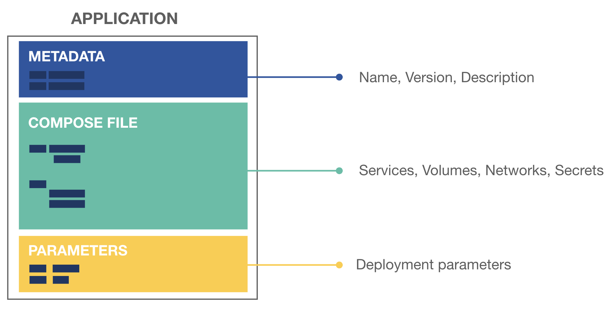

# Exercise - Creating the Docker Application

> **Time**: Approximately 20 minutes
>
> **Difficulty**: Easy

## Exercise Objectives

By the end of this exercise, you will have:

- Created a Docker Application package
- Learned about the application package components
- Learned how to validate the application
- Learned about building and inspecting an application

## Docker Application Overview

Application packages are a construction above compose files to improve application lifecycle and workflow, from development to test to production. An application package is a set of 3 documents:

1. A `metadata.yml` file describing the application metadata (name, version, description, ...)
2. A `docker-compose.yml` file describing the application structure (what we have right now)
3. A `parameters.yml` file with key/value parameters (we will use this in the next exercise)

You can also include any of your own custom files, including config files. These additional files are called `attachments`.



## Initialize the Application

1. Let's look at the `docker app init` command and see it's options.

    ```bash
    $ docker app init --help

    Usage:	docker app init APP_NAME [--compose-file COMPOSE_FILE] [OPTIONS]

    Start building a Docker Application package.

    Examples:
    $ docker app init myapp

    Options:
        --compose-file string   Compose file to use as application base (optional)
    ```

2. Let's now create our Docker app! We will use the `docker app init` command and specify the compose file.

    ```bash
    $ docker app init voting-app --compose-file path/to/my/docker-compose.yml
    Created "voting-app.dockerapp"
    ```

3. If you run `tree`, you'll see a new directory. The name is your app name with a `.dockerapp` suffix. Let's look inside the directory.

    ```bash
    $ tree
    .
    ├── docker-compose.yml
    └── voting-app.dockerapp
        ├── docker-compose.yml
        ├── metadata.yml
        └── parameters.yml

    1 directory, 4 files
    ```

4. The compose file is a copy of the file you were working with earlier. If you open the `metadata.yml` file, you'll see the config we specified during initialization.

    ```bash
    $ cat voting-app.dockerapp/metadata.yml
    # Version of the application
    version: 0.1.0
    # Name of the application
    name: voting-app
    # A short description of the application
    description: 
    # List of application maintainers with name and email for each
    maintainers:
      - name: root
        email: 
    ```

## Validating our Application

Before we're ready to ship our application, we should validate it to make sure everything is set. Specifically, validation does the following:

- Ensures our compose file is valid (correct syntax, etc.)
- Ensures required metadata is provided (name, version) and is the correct format
- Ensures all parameters (which we'll talk about next) have default values

1. Run the `docker app validate` command to make sure our application is valid.

    ```bash
    $ docker app validate
    Validated "/root/voting-app.dockerapp"
    ```

2. Let's make a change to invalidate the application. In the `voting-app.dockerapp/metadata.yml` file, comment out the `version` field using a `#`. Then, revalidate.

    ```bash
    $ docker app validate
    failed to validate metadata:
    - version: version is required
    ```

    We have an error! Go ahead and fix it and revalidate.

## Building our Application 

Once our application is ready, we can build it. Building an application means
- building all the service images
- building the invocation image (we will look closely at what is an invocation image in exerise 6).
- building the application image

1. Let's look at `docker app build` and its options
    ```bash
    $ docker app build --help

    Usage:	docker app build [APP_NAME] [OPTIONS]

    Build service images for the application

    Examples:
    $ docker app build myapp.dockerapp --tag my/app:1.0.0

    Options:
        --no-cache          Do not use cache when building the image
        --progress string   Set type of progress output (auto, plain, tty). Use plain to show
                            container output (default "auto")
        --pull              Always attempt to pull a newer version of the image
    -t, --tag string        Application image and optionally a tag in the 'image:tag' format
    ```

2. Build your application and give it a tag.

    <details>
      <summary>Solution/Full Output</summary>

    ```bash
    $ docker app build voting-app.dockerapp --tag myapp/voting-app:0.1.0
    [+] Building 0.0s (6/6) FINISHED                                                                           
    => CACHED [internal] load remote build context                                                       0.0s
    => CACHED copy /context /                                                                            0.0s
    => [internal] load metadata for docker.io/docker/cnab-app-base:v0.8.0-222-gc9b862782a                0.0s
    => [1/2] FROM docker.io/docker/cnab-app-base:v0.8.0-222-gc9b862782a                                  0.0s
    => CACHED [2/2] COPY . .                                                                             0.0s
    => exporting to image                                                                                0.0s
    => => exporting layers                                                                               0.0s
    => => writing image sha256:89ed7688293f72d01706c501d7657e26c3097b33ae4d9cd8ad0853bbe813923b          0.0s
    Successfully built service images
    Successfully build docker.io/myapp/voting-app:0.1.0
    ```
    **NOTE**: The output may differ here.
    </details>
:tada: You just built your first Docker Application Image ! It's now ready to be inspected, run or pushed!

## Inspecting our Docker Application

We can use the `docker app inspect` command to get a quick overview of all of the services, number of replicas, ports, and the image being used. This allows an ops admin to review all main the elements before deploying to production, without having to manually parse the compose file.
This JSON output can be used programmatically by other tools.

1. Run the `docker app inspect <TAG>` command to inspect our application.

    <details>
      <summary>Solution/Full Output</summary>

    ```bash
    $ docker app inspect myapp/voting-app:0.1.0
    {
        "Metadata": {
            "version": "0.1.0",
            "name": "voting-app",
            "maintainers": [
                {
                    "name": "djordjelukic"
                }
            ]
        },
        "Services": [
            {
                "Name": "db",
                "Image": "postgres:9.4",
                "Replicas": 1
            },
            {
                "Name": "proxy",
                "Image": "traefik",
                "Replicas": 1,
                "Ports": "5000,8080"
            },
            {
                "Name": "redis",
                "Image": "redis:alpine",
                "Replicas": 1
            },
            {
                "Name": "results",
                "Image": "mikesir87/examplevotingapp_result",
                "Replicas": 1
            },
            {
                "Name": "vote",
                "Image": "mikesir87/examplevotingapp_vote",
                "Replicas": 2
            },
            {
                "Name": "worker",
                "Image": "dockersamples/examplevotingapp_worker",
                "Replicas": 1
            }
        ],
        "Networks": [
            "backend",
            "frontend",
            "proxy"
        ]
    }
    ```
    </details>

`docker app inspect` also provides an pretty printer, using `--pretty` flag. Let's try it :thumbsup:
1. Run the `docker app inspect <TAG> --pretty` command to inspect our application.

    <details>
      <summary>Solution/Full Output</summary>

    ```bash
    $ docker app inspect myapp/voting-app:0.1.0 --pretty
    version: 0.1.0
    name: voting-app
    description: ""
    maintainers:
    - name: root
    email: ""


    Services (5) Replicas Ports Image
    ------------ -------- ----- -----
    db           1              postgres:9.4
    redis        1              redis:alpine
    results      1              mikesir87/examplevotingapp_result
    vote         2              mikesir87/examplevotingapp_vote
    worker       1              dockersamples/examplevotingapp_worker

    Networks (2)
    ------------
    backend
    frontend
    ```
    </details>