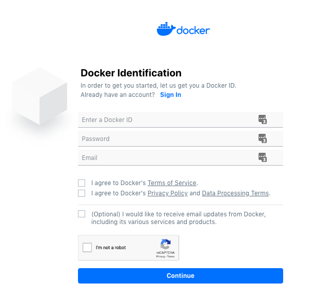

# Set up your environment

> **Time**: Approximately 10 minutes
>
> **Difficulty**: Easy

## Table of Contents
1. [Create a Docker Hub account](#create-a-docker-hub-account)
1. [Set Up 'Play With Docker'](#set-up-play-with-docker)
1. [Introduction to Docker Contexts](#introduction-to-docker-contexts)
1. [How to save your work](#how-to-save-your-work)

## Exercise Objectives

By the end of this exercise you will:

- Have created a Docker Hub account (unless you already have one)
- Learn how to use Play With Docker
- Learn how to install new Docker CLI Plugins
- Learn how to use Docker Contexts
- Learn how to save your workshop files

## Create a Docker Hub account

1. If you already have a Docker Hub account, go to **step 5**

2. Go to https://hub.docker.com and click on the "Sign up for Docker Hub" button.

    <details>
      <summary>Details</summary>

    
    </details>

3. Complete the registration form by providing your Docker ID, password, and an email address.

    <details>
      <summary>Details</summary>

    
    </details>

4. Check your mailbox and confirm your email address.

    <details>
      <summary>Details</summary>

    
    </details>

5. Sign in to Docker Hub to validate your credentials work.

    <details>
      <summary>Details</summary>

    https://hub.docker.com

    
    </details>


## Set Up 'Play With Docker'

This workshop will be using [Play With Docker](https://labs.play-with-docker.com) to help everyone have the same experience and reduce our dependency on the conference WiFi to push/pull GBs of images. You can still follow the instructions locally with your own engine.

:warning: **Don't forget to save all of your work on your laptop before leaving the workshop.**

### Getting into Play with Docker

1. Go to https://labs.play-with-docker.com

    <details>
      <summary>Details</summary>

    
    </details>

2. Click on the `Login` dropdown, choose `Docker` and sign in using your `Docker Hub` credentials

    <details>
      <summary>Details</summary>

    
    </details>

3. The `Login` button should turn into a `Start` button. Click the `Start` button to get started!

    <details>
      <summary>Details</summary>

    
    </details>

4. A new session is opened, which will be closed in **4 hours**. You can add multiple new instances and delete them. Each one has it's own engine and own prompt. You can also ssh directly to it if you feel more comfortable with your own terminal.


### Creating our Instances

For this workshop, we will simulate a basic workflow with two environments:

- A local development environment, represented as a single non-Swarm node
- A remote Swarm cluster

1. Create a swarm cluster by clicking on the wrench (:wrench:) and selecting the `1 Manager and 1 Worker` template. 

    <details>
      <summary>Details</summary>

    
    </details>

    It just added 2 nodes, one **manager1** and one **worker1**.
    
2. On the **manager1** node, run `docker node ls` and validate you have two nodes. If you don't, run `docker swarm join-token worker`, copy the token, and run the copied `docker swarm join` command on the **worker1** node.

    <details>
      <summary>Details</summary>
    
    On **manager1** node:
    ```console
    $ docker node ls
    ID                            HOSTNAME            STATUS              AVAILABILITY        MANAGER STATUS      ENGINE VERSION
    du64yyv64u3gpypkqwb8cli39 *   manager1            Ready               Active              Leader              18.09.4
    [manager1] (local) root@192.168.0.43 ~
    $ docker swarm join-token worker
    To add a worker to this swarm, run the following command:

        docker swarm join --token SWMTKN-1-4v4o696r1t6zwcimz8pazuxnwwuh2vjol7zejt33d2erp5wp4g-bbp8kcw4uk7mt9snusp6xh2io 192.168.0.43:2377
    ```
    
    Copy the `docker swarm join` command and run it on the **worker1** node. 
    
    ```console
    docker swarm join --token SWMTKN-1-4v4o696r1t6zwcimz8pazuxnwwuh2vjol7zejt33d2erp5wp4g-bbp8kcw4uk7mt9snusp6xh2io 192.168.0.43:237
    This node joined a swarm as a worker.
    ```
    
    Then, on the **manager1** node, `docker node ls` should show two nodes.
    
    ```console
    $ docker node ls
    ID                            HOSTNAME            STATUS              AVAILABILITY        MANAGER STATUS      ENGINE VERSION
    du64yyv64u3gpypkqwb8cli39 *   manager1            Ready               Active              Leader              18.09.4
    z6l2z7terttlxp33kym0rg4tn     worker1             Ready               Active                                  18.09.4
    ```
    </details>

3. Now let's add a local **development node**: click on **+ ADD NEW INSTANCE**

    <details>
      <summary>Details</summary>

    
    </details>

4. We will be doing most of our work from this new instance (**node1**). Select it.

5. Login to Docker Hub using the `docker login` command and your credentials.

    ```console
    $ docker login
    Login with your Docker ID to push and pull images from Docker Hub. If you don't have a Docker ID, head over to https://hub.docker.com to create one.
    Username: dapworkshop
    Password:
    WARNING! Your password will be stored unencrypted in /root/.docker/config.json.
    Configure a credential helper to remove this warning. See
    https://docs.docker.com/engine/reference/commandline/login/#credentials-store

    Login Succeeded
    ```


### Installing Docker App

To install Docker App, you can download the release directly from the [Releases page on GitHub](https://github.com/docker/app/releases) and install it. But, for simplicity, we have packaged it up into a container image to make it easier.

Docker CLI plugins are installed in the `~/.docker/cli-plugins` directory.

1. Run the `dapworkshop/workshop:0.9` image, mounting the home directory into the container.

    ```console
    $ docker run -v ~/:/workshop dapworkshop/workshop:0.9
    ```

2. Check `docker app` is installed properly

    ```console
    $ docker app --version
    Version:               v0.9.0-zeta1
    Git commit:            64e685eb
    Built:                 Tue Oct 15 15:49:04 2019
    OS/Arch:               linux/amd64
    ```

3. Run `tree .docker` and you'll see the plugin installed!

    ```console
    $ tree ~/.docker/
    /root/.docker/
    ├── cli-plugins
    │   └── docker-app
    └── config.json

    1 directory, 2 files
    ```

**Congratulations** :clap: You just installed your first Docker CLI plugin on your own!

Now the workshop can really start!

## Introduction to Docker Contexts

**Docker Contexts** is a new Docker CLI `19.03` feature. For those who already know about Kubernetes contexts, you will notice that Docker Contexts look familiar.

With contexts, you can quickly switch between your different environments, such as:

* Local daemon
* Remote cluster
* Even locally switch between orchestrators Swarm/Kubernetes

The context commands let you manage all your contexts:

```console
$ docker context

Usage:  docker context COMMAND

Manage contexts

Commands:
  create      Create a context
  export      Export a context to a tar or kubeconfig file
  import      Import a context from a tar file
  inspect     Display detailed information on one or more contexts
  ls          List contexts
  rm          Remove one or more contexts
  update      Update a context
  use         Set the current docker context
```

Docker will always come with a **default** context:
```console
$ docker context ls
NAME                DESCRIPTION                               DOCKER ENDPOINT               KUBERNETES ENDPOINT   OHESTRATOR
default *           Current DOCKER_HOST based configuration   unix:///var/run/docker.sock                         swarm
```
**Note:** The little star (**\***) indicates which context is currently in use.


### Create a Swarm Context

Let's create a new context to let us deploy to our swarm cluster from our development instance. To do so, we will use the `docker context create` command.

When creating a new context, you are able to define some information for the new context. Some of this information might include:

- A name
- A description
- A default orchestrator on this context
- Some Docker endpoint options, in a comma separated `key=value` format
- Some Kubernetes endpoint options, in a comma separated `key=value` format

<details>
  <summary>Full details of flags and options available for <b>docker context create</b></summary>

```console
$ docker context create --help

Usage:  docker context create [OPTIONS] CONTEXT

Create a context

Docker endpoint config:

NAME                DESCRIPTION
from                Copy named context's Docker endpoint configuration
host                Docker endpoint on which to connect
ca                  Trust certs signed only by this CA
cert                Path to TLS certificate file
key                 Path to TLS key file
skip-tls-verify     Skip TLS certificate validation

Kubernetes endpoint config:

NAME                 DESCRIPTION
from                 Copy named context's Kubernetes endpoint configuration
config-file          Path to a Kubernetes config file
context-override     Overrides the context set in the kubernetes config file
namespace-override   Overrides the namespace set in the kubernetes config file

Example:

$ docker context create my-context --description "some description" --docker "host=tcp://myserver:2376,ca=~/ca-file,cert=~/cert-file,key=~/key-file"

Options:
      --default-stack-orchestrator string   Default orchestrator for stack operations to use with this context (swarm|kubernetes|all)
      --description string                  Description of the context
      --docker stringToString               set the docker endpoint (default [])
      --from string                         create context from a named context
      --kubernetes stringToString           set the kubernetes endpoint (default [])
```
</details>
<br/>


1. First we need to get the Swarm manager IP address. Look in the left sidebar for the IP address for the **manager1** node.

    ```bash
    # Swap in your real IP address
    MANAGER_IP=192.168.0.7
    ```

2. Let's create our context to target the swarm cluster we created. We will simply name it `swarm`.

    ```console
    $ docker context create swarm --description "remote cluster" --default-stack-orchestrator=swarm --docker "host=tcp://${MANAGER_IP}:2375"
    swarm
    Successfully created context "swarm"
    ```

3. Run `docker context ls` to see the new context.

    ```console
    $ docker context ls
    NAME                DESCRIPTION                               DOCKER ENDPOINT               KUBERNETES ENDPOINT   ORCHESTRATOR
    default *           Current DOCKER_HOST based configuration   unix:///var/run/docker.sock                         swarm
    swarm               remote cluster                            tcp://192.168.0.7:2375                              swarm
    ```

4. To validate the context is setup correctly, let's start a container on the manager node.

    1. Select the **manager1** instance and run `docker run hello-world`.
    2. Back on the **node** instance, run `docker ps -a`. You should only see the workshop container we ran earlier.
        ```console
        $ docker ps -a
        CONTAINER ID        IMAGE                         COMMAND             CREATED             STATUS                      PORTS NAMES
        dc823bc61e60        dapworkshop/dc2019-workshop   "/run.sh"           2 minutes ago       Exited (0) 2 minutes ago          cocky_minsky
        ```
    3. Now run `docker --context=swarm ps -a`. You should now see the `hello-world` container.
        ```console
        $ docker --context=swarm ps -a
        CONTAINER ID        IMAGE               COMMAND             CREATED             STATUS                      PORTS               NAMES
        1541322b8f2b        hello-world         "/hello"            1 minute ago        Exited (0) 1 minute ago                         reverent_ptolemy
        ```

5. While the `--context` flag is great, it would be nice to switch our entire CLI to use the swarm cluster. To do so, we use the `docker context use` command and give it the name of the context to use. Run `docker context use swarm` and then see that the various commands are running against that engine.

    ```console
    $ docker context use swarm
    swarm
    Current context is now "swarm"

    $ docker context ls
    NAME                DESCRIPTION                               DOCKER ENDPOINT               KUBERNETES ENDPOINT   ORCHESTRATOR
    default             Current DOCKER_HOST based configuration   unix:///var/run/docker.sock                         swarm
    swarm *             remote cluster                            tcp://192.168.0.7:2375                              swarm

    $ docker ps -a
    CONTAINER ID        IMAGE               COMMAND             CREATED             STATUS                      PORTS               NAMES
    1541322b8f2b        hello-world         "/hello"            2 minutes ago       Exited (0) 2 minutes ago                        reverent_ptolemy
    ```

6. We can also create a context _from_ another one. Let's create a development context, targeting our local daemon:

    ```console
    $ docker context create dev --from default --description "development node"

    $ docker context ls
    NAME                DESCRIPTION                               DOCKER ENDPOINT               KUBERNETES ENDPOINT   ORCHESTRATOR
    default             Current DOCKER_HOST based configuration   unix:///var/run/docker.sock                         swarm
    dev                 development node                          unix:///var/run/docker.sock                         swarm
    swarm *             remote cluster                            tcp://192.168.0.7:2375                              swarm
    ```

7. Let's switch back to our development context:
    ```console
    $ docker context use dev
    dev
    Current context is now "dev"
    ```

### (Optional) Import/Export contexts

A very handy pair of commands is **docker context import/export**. With these commands, you can quickly configure a new Docker CLI with all the contexts you are used to work with. The **export** command creates a tarball file with:

- All the context information (host, name, description...)
- All the TLS/Certificates files associated with the context

**NOTE**: It can also export to a **kubeconfig** file all your Kubernetes cluster configuration.

1. Use **docker context export** to export your `swarm` context.


    ```console
    $ docker context export swarm
    Written file "swarm.dockercontext"
    ```

2. Import the context as a new context using `docker context import`.

   ```console
    $ docker context import imported-swarm swarm.dockercontext
    imported-swarm
    Successfully imported context "imported-swarm"

    $ docker context ls
    NAME                DESCRIPTION                               DOCKER ENDPOINT               KUBERNETES ENDPOINT   ORCHESTRATOR
    default             Current DOCKER_HOST based configuration   unix:///var/run/docker.sock                         swarm
    dev *               development node                          unix:///var/run/docker.sock                         swarm
    imported-swarm      remote cluster                            tcp://192.168.0.7:2375                              swarm
    swarm               remote cluster                            tcp://192.168.0.7:2375                              swarm
    ```

    **NOTE:** import/export support the standard input/output using `-`, so you can import/export in one line

    ```console
    $ docker context export swarm - | docker context import imported-swarm2 -
    imported-swarm2
    Successfully imported context "imported-swarm2"
    ```

3. Go ahead and remove the new context to prevent confusion going forward. Use the `docker context rm` command to do so.

    ```console
    $ docker context rm imported-swarm imported-swarm2
    imported-swarm
    imported-swarm2
    ```

## How to save your work

**You may want to set a reminder to save your exercises locally before leaving the workshop. We will remind you at the end as well.**.

For those using PWD, you can copy/paste the `SSH` address and use it to `SCP` (Secure File Copy through SSH) all your files:


```sh
# run this locally
$ scp -rp ip172-18-0-23-bg01fj0v0j3g00d0atfg@direct.labs.play-with-docker.com:/root .
```
