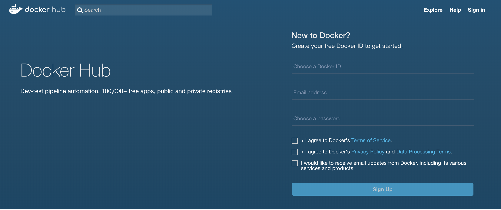
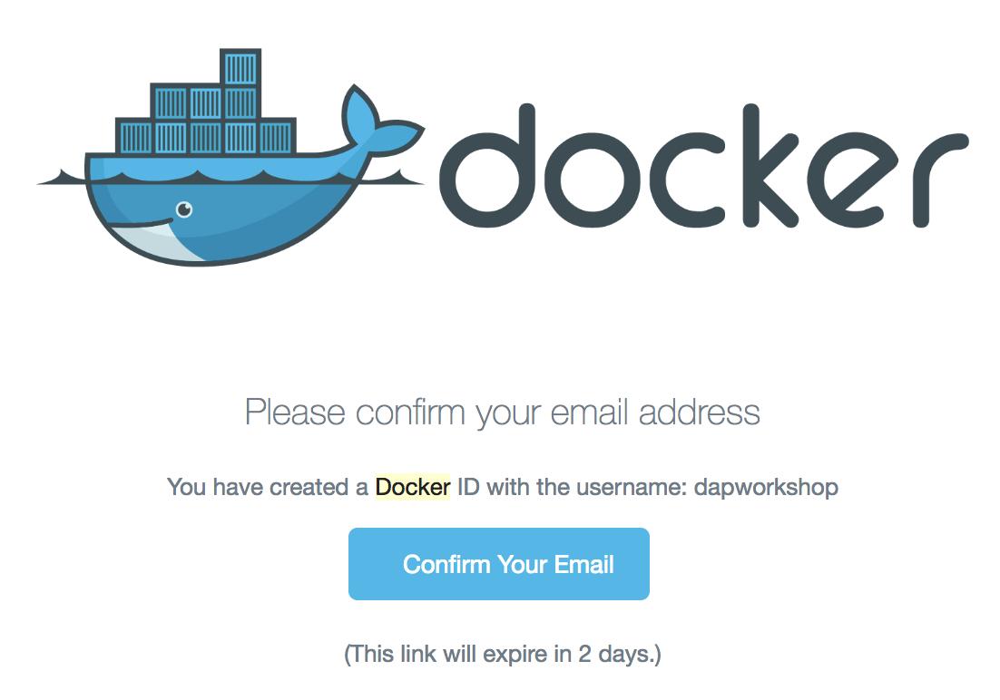
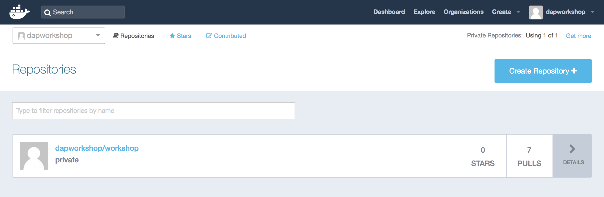
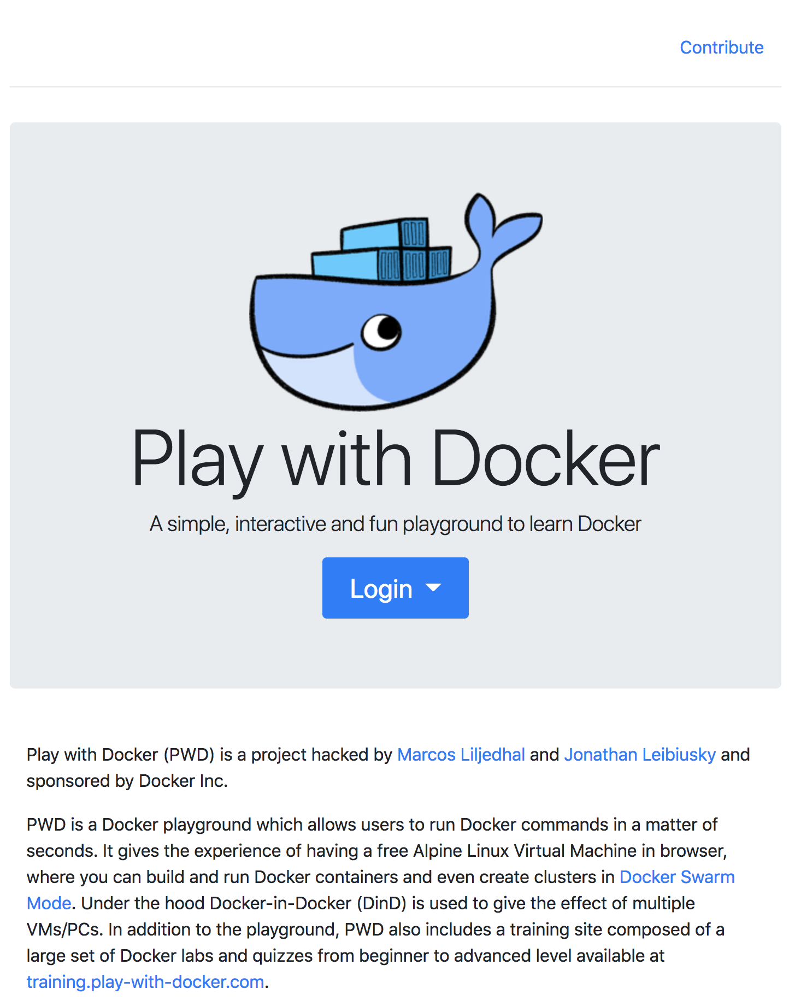
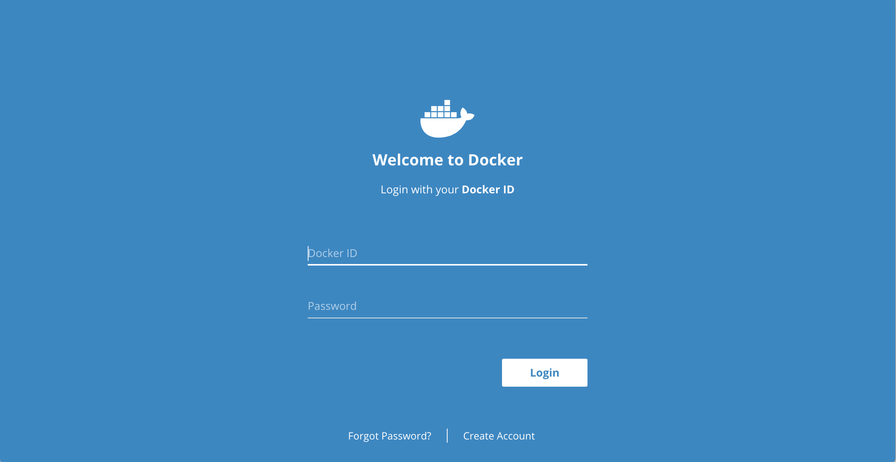
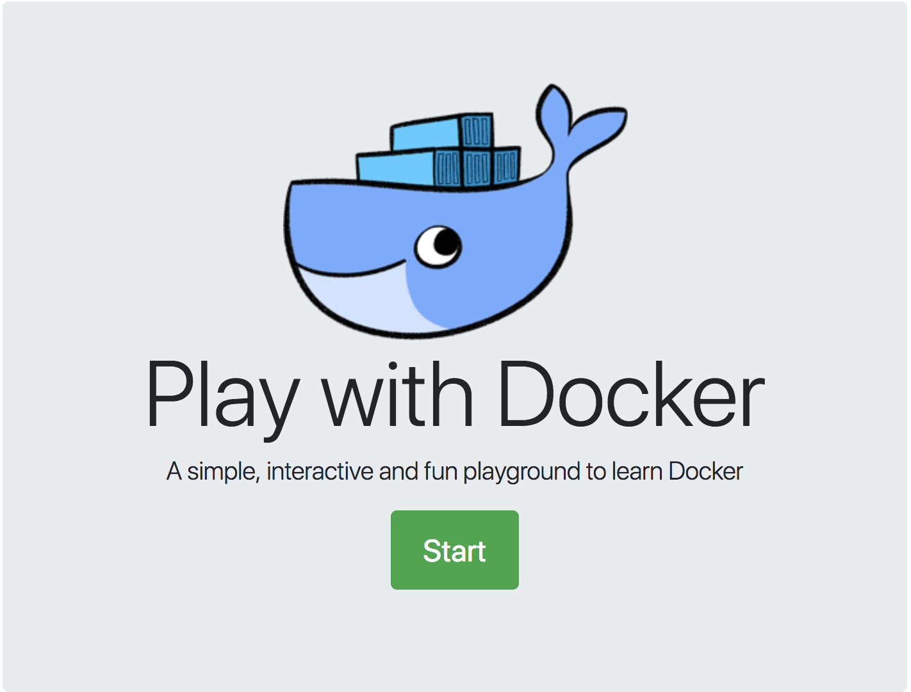
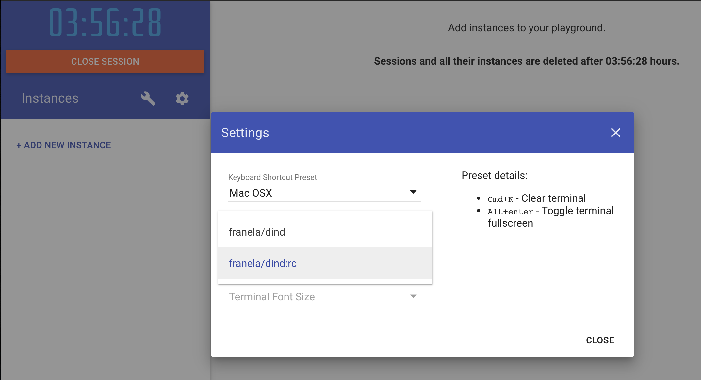
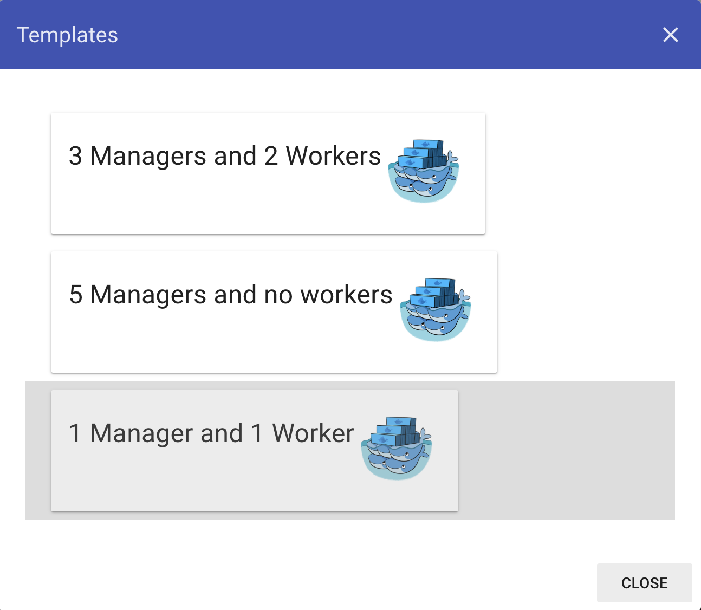
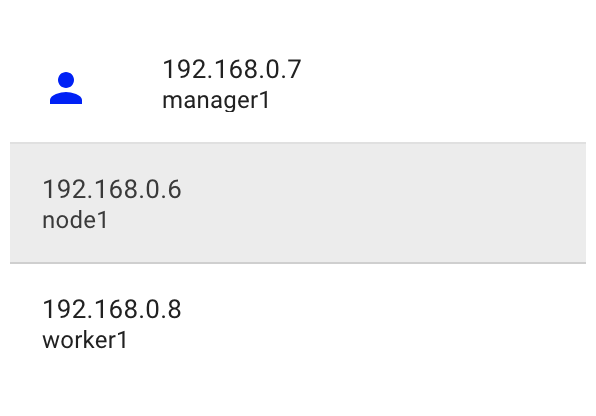
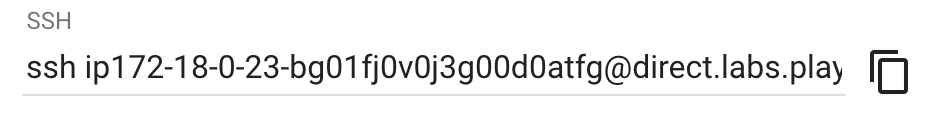

# Set up your environment

> **Time**: Approximately 10 minutes
> **Difficulty**: Easy

## Table of Contents
1. [Create a Docker Hub account](#create-a-docker-hub-account)
1. [Set Up 'Play With Docker'](#set-up-play-with-docker)
1. [Introduction to Docker Contexts](#introduction-to-docker-contexts)
1. [How to save your work](#how-to-save-your-work)

> During this workshop you will learn: 
> * how to create a Docker Hub account
> * how to use Play With Docker
> * how to install new Docker CLI Plugins
> * how to use Docker Contexts
> * how to save your workshop files

## Create a Docker Hub account

**1.** If you already have a Docker Hub account, go to **step 5**

**2.** Go to https://hub.docker.com

<details>
  <summary>Details</summary>


</details>
<br/>

**3.** Sign up with a `login`, `password` and email

**4.** Check your mailbox and confirm your email

<details>
  <summary>Details</summary>


</details>
<br/>

**5.** Sign in to Docker Hub

<details>
  <summary>Details</summary>

https://hub.docker.com


</details>


## Set Up 'Play With Docker'

This workshop uses [Play With Docker](https://labs.play-with-docker.com), so everyone can have the same experience and we don't rely on WiFi to push/pull Gigabytes of images.
You can still follow the instructions locally with your own engine.

:warning: **Don't forget to save on your laptop all your exercises before leaving the workshop**.

**1.** Go to https://labs.play-with-docker.com

<details>
  <summary>Details</summary>


</details>
<br/>

**2.** Click on the `Login` dropdown, choose `Docker` and sign in using your `Docker Hub` credentials

<details>
  <summary>Details</summary>


</details>
<br/>

**3.** Start !

<details>
  <summary>Details</summary>


</details>
<br/>

**4.** A new session is opened, which will be closed in **4 hours**. You can add multiple new instances and delete them. Each one has it's own engine and own prompt. You can also ssh directly to it if you feel more comfortable with your own terminal.

Click on the configuration wheel and select **franela/dind:rc** image. You will then use the latest beta release of Docker.

<details>
  <summary>Details</summary>


</details>
<br/>

**5.**  Now **add some new instances**.

For this workshop we will try to simulate a basic workflow with 2 environments:
* a local development environment with one node
* a remote swarm cluster

First we will create the **swarm cluster**: click on the wrench :wrench: to select the `1 Manager and 1 Worker` template.

<details>
  <summary>Details</summary>


</details>
<br/>

It just added 2 nodes, one **manager1** and one **worker1**.

Now let's add a local **development node**: click on **ADD NEW INSTANCE**

<details>
  <summary>Details</summary>


</details>
<br/>

We will focus on this freshly created **node1**. Select it.

**6.** Install the latest release of **docker app**

Try running **docker app**, it should fail :boom:
```console
$ docker app
docker: 'app' is not a docker command.
See 'docker --help'
```

Copy/paste and run the following command:

```console
$ docker run -v ~/:/workshop dapworkshop/dc2019-workshop
```

What we just did here:
* Create a new `~/.docker/cli-plugins` directory
* Put new `docker-app` plugin binary in it
```console
$ tree .docker
.docker
└── cli-plugins
    └── docker-app

1 directory, 1 file
```

**Congratulations** :clap: You just installed yourself your first Docker CLI plugin!

**7.** Login to the Docker Hub using your credentials

```console
$ docker login
Login with your Docker ID to push and pull images from Docker Hub. If you don't have a Docker ID, head over to https://hub.docker.com to create one.
Username: dapworkshop
Password:
WARNING! Your password will be stored unencrypted in /root/.docker/config.json.
Configure a credential helper to remove this warning. See
https://docs.docker.com/engine/reference/commandline/login/#credentials-store

Login Succeeded
```

Now the workshop can really start!

## Introduction to Docker Contexts

**Docker Contexts** is a new Docker CLI `19.03` feature.
For those who already know Kubernetes contexts, Docker Contexts will look familiar.

With contexts, you can quickly switch between your different environments:
* Local daemon
* Remote cluster
* Even locally switch between orchestrators Swarm/Kubernetes

The context commands let you manage all your contexts:
```console
$ docker context

Usage:  docker context COMMAND

Manage contexts

Commands:
  create      Create a context
  export      Export a context to a tar or kubeconfig file
  import      Import a context from a tar file
  inspect     Display detailed information on one or more contexts
  ls          List contexts
  rm          Remove one or more contexts
  update      Update a context
  use         Set the current docker context
```

Docker will always come with a **default** context:
```console
$ docker context ls
NAME                DESCRIPTION                               DOCKER ENDPOINT               KUBERNETES ENDPOINT   ORCHESTRATOR
default *           Current DOCKER_HOST based configuration   unix:///var/run/docker.sock                         swarm
```
**Note** Here the little star **\*** indicates which context is in use.

### Create a Swarm Context

Let's create a new context, targeting our Swarm cluster.

<details>
  <summary><b>docker context create</b> details</summary>

```console
$ docker context create --help

Usage:  docker context create [OPTIONS] CONTEXT

Create a context

Docker endpoint config:

NAME                DESCRIPTION
from                Copy named context's Docker endpoint configuration
host                Docker endpoint on which to connect
ca                  Trust certs signed only by this CA
cert                Path to TLS certificate file
key                 Path to TLS key file
skip-tls-verify     Skip TLS certificate validation

Kubernetes endpoint config:

NAME                 DESCRIPTION
from                 Copy named context's Kubernetes endpoint configuration
config-file          Path to a Kubernetes config file
context-override     Overrides the context set in the kubernetes config file
namespace-override   Overrides the namespace set in the kubernetes config file

Example:

$ docker context create my-context --description "some description" --docker "host=tcp://myserver:2376,ca=~/ca-file,cert=~/cert-file,key=~/key-file"

Options:
      --default-stack-orchestrator string   Default orchestrator for stack operations to use with this context (swarm|kubernetes|all)
      --description string                  Description of the context
      --docker stringToString               set the docker endpoint (default [])
      --from string                         create context from a named context
      --kubernetes stringToString           set the kubernetes endpoint (default [])
```
</details>
<br/>

**docker context create** lets you define some informations about your new context:
- a name
- a description
- a default orchestrator on this context
- some Docker enpoint options, in a comma separated `key=value` format
- some Kubernetes enpoint options, in a comma separated `key=value` format

First we need to get the Swarm manager IP address, detailed in the nodes list.

Let's create our first context :tada:
```console
$ docker context create swarm --description "remote cluster" --default-stack-orchestrator=swarm --docker "host=tcp://192.168.0.7:2375"
swarm
Successfully created context "swarm"
```
The context can be listed with `docker context ls`:
```console
$ docker context ls
NAME                DESCRIPTION                               DOCKER ENDPOINT               KUBERNETES ENDPOINT   ORCHESTRATOR
default *           Current DOCKER_HOST based configuration   unix:///var/run/docker.sock                         swarm
swarm               remote cluster                            tcp://192.168.0.7:2375                              swarm
```

Now **check it works**:
- Select `manager1` and run `docker run hello-world`
- Select back `node1` and run `docker ps -a`, it should show your **docker app** installation
```console
$ docker ps -a
CONTAINER ID        IMAGE                         COMMAND             CREATED             STATUS                      PORTS NAMES
dc823bc61e60        dapworkshop/dc2019-workshop   "/run.sh"           2 minutes ago       Exited (0) 2 minutes ago          cocky_minsky
```
- Now try `docker --context=swarm ps -a`
```console
$ docker ps -a
CONTAINER ID        IMAGE               COMMAND             CREATED             STATUS                      PORTS               NAMES
1541322b8f2b        hello-world         "/hello"            1 minute ago        Exited (0) 1 minute ago                         reverent_ptolemy
```
- The **use** will change the current context
```console
$ docker context use swarm
swarm
Current context is now "swarm"

$ docker context ls
NAME                DESCRIPTION                               DOCKER ENDPOINT               KUBERNETES ENDPOINT   ORCHESTRATOR
default             Current DOCKER_HOST based configuration   unix:///var/run/docker.sock                         swarm
swarm *             remote cluster                            tcp://192.168.0.7:2375                              swarm

$ docker ps -a
CONTAINER ID        IMAGE               COMMAND             CREATED             STATUS                      PORTS               NAMES
1541322b8f2b        hello-world         "/hello"            2 minutes ago       Exited (0) 2 minutes ago                        reverent_ptolemy
```

We can also create a context **from** another one. Let's create a development context, targeting our local daemon:
```console
$ docker context create dev --from default --description "development node"

$ docker context ls
NAME                DESCRIPTION                               DOCKER ENDPOINT               KUBERNETES ENDPOINT   ORCHESTRATOR
default             Current DOCKER_HOST based configuration   unix:///var/run/docker.sock                         swarm
dev                 development node                          unix:///var/run/docker.sock                         swarm
swarm *             remote cluster                            tcp://192.168.0.7:2375                              swarm
```

Let's switch back to our development context:
```console
$ docker context use dev
dev
Current context is now "dev"
```

### Import/Export contexts

A very handy pair of commands is the **import/export**. With it you can quickly configure a new Docker CLI with all the contexts you are used to work with.
The **export** command creates a selfcontained tarball file with:
- all the context informations (host, name, description...)
- all the TLS/Certificates files associated with the context

**NOTE**: It can also export to a **kubeconfig** file all your Kubernetes cluster configuration.

**EXERCISE**:
> Try to **export** your `swarm` context then **import** it to another context name:

<details>
  <summary>Solution</summary>

```console
$ docker context export swarm
Written file "swarm.dockercontext"

$ docker context import imported-swarm swarm.dockercontext
imported-swarm
Successfully imported context "imported-swarm"

$ docker context ls
NAME                DESCRIPTION                               DOCKER ENDPOINT               KUBERNETES ENDPOINT   ORCHESTRATOR
default             Current DOCKER_HOST based configuration   unix:///var/run/docker.sock                         swarm
dev *               development node                          unix:///var/run/docker.sock                         swarm
imported-swarm      remote cluster                            tcp://192.168.0.7:2375                              swarm
swarm               remote cluster                            tcp://192.168.0.7:2375                              swarm
```

**NOTE** import/export support the standard input/output using `-`, so you can import/export in one line
```console
$ docker context export swarm - | docker context import imported-swarm2 -
imported-swarm2
Successfully imported context "imported-swarm2"
```

Don't forget to **remove** it!
```console
$ docker context rm imported-swarm imported-swarm2
imported-swarm
imported-swarm2
```
</details>

## How to save your work

**You may want to set a reminder to save your exercises locally before leaving the workshop. We will remind you at the end as well.**.

For those using PWD, you can copy/paste the `SSH` address and use it to `SCP` (Secure File Copy through SSH) all your files:



```sh
# run this locally
$ scp -rp ip172-18-0-23-bg01fj0v0j3g00d0atfg@direct.labs.play-with-docker.com:/root/workshop .
```
