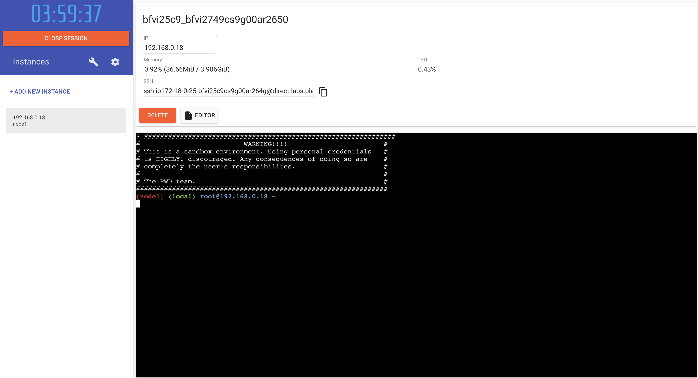

# Set up your environment

> **Time**: Approximately 10 minutes
> **Difficulty**: Easy

## Table of Contents
1. [Create a Docker Hub account](#create-a-docker-hub-account)
1. [Set Up 'Play With Docker'](#set-up-play-with-docker)
1. [How to save your work](#how-to-save-your-work)

## Create a Docker Hub account

During this workshop you will need a Docker Hub account.

**1.** If you already have a Docker Hub account, go to **step 5**

**2.** Go to https://hub.docker.com


**3.** Sign up with a `login`, `password` and email

**4.** Check your mailbox and confirm your email


**5.** Sign in to Docker Hub

https://hub.docker.com


## Set Up 'Play With Docker'

This workshop uses [Play With Docker](https://labs.play-with-docker.com), so everyone can have the same experience and we don't rely on WiFi to push/pull Gigabytes of images.
You can still follow the instructions locally with your own engine.

:warning: **Don't forget to save on your laptop all your exercises before leaving the workshop**.

**1.** Go to https://labs.play-with-docker.com


**2.** Click on the `Login` dropdown, choose `Docker` and sign in using your `Docker Hub` credentials


**3.** Start !


**4.** A new session is opened, which will be closed in **4 hours**. You can add multiple new instances and delete them. Each one has it's own engine and own prompt. You can also ssh directly to it if you feel more comfortable with your own terminal. Now **add a new instance**.



**5.** Login to the Docker Hub using your credentials

```sh
$ docker login
Login with your Docker ID to push and pull images from Docker Hub. If you don't have a Docker ID, head over to https://hub.docker.com to create one.
Username: dapworkshop
Password:
WARNING! Your password will be stored unencrypted in /root/.docker/config.json.
Configure a credential helper to remove this warning. See
https://docs.docker.com/engine/reference/commandline/login/#credentials-store

Login Succeeded
```

Now the workshop can really start!

## How to save your work

**You may want to set a reminder to save your exercises locally before leaving the workshop. We will remind you at the end as well.**.

For those using PWD, you can copy/paste the `SSH` address and use it to `SCP` (Secure File Copy through SSH) all your files:


```sh
# run this locally
$ scp -rp ip172-18-0-23-bg01fj0v0j3g00d0atfg@direct.labs.play-with-docker.com:/root/workshop .
```
